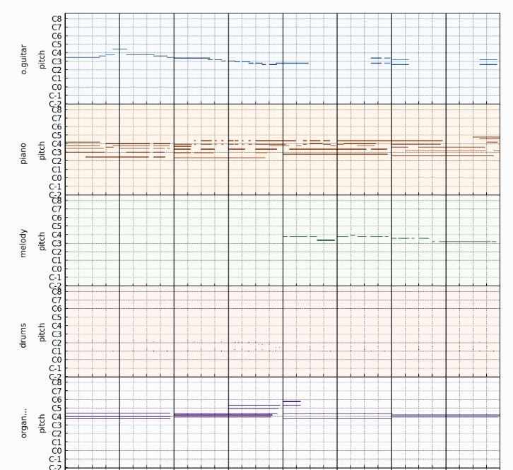
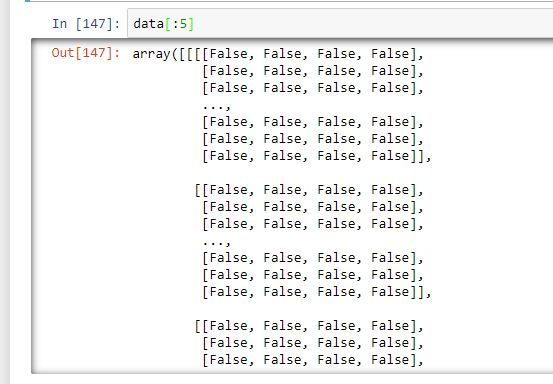
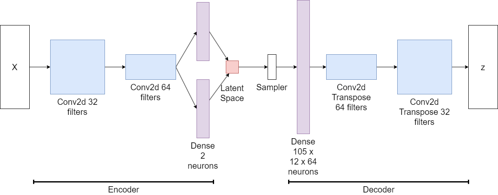

# ADL Final Aidan Sullvivan
### Comparing the Euclidean distance of the latent spaces of midi files generated from a variational autoencoder.

## Introduction

My goal with this project was to test if the latent space generated by a variational autoencoder can be used to compare the similarity of songs. The original purpose of autoencoders was compression. Latent spaces are much smaller in size compared to image and song files. Comparing a midi file with another by comparing all of the pitch and timestep values is a more expensive operation than comparing two latent spaces. Additionally, a latent spaces might be more representative of a songs attributes than just the pitch and timestep values. This project was partly inspired by the Google Image Embedding competition on kaggle and built using data from the [musegan](https://salu133445.github.io/musegan/) project created by Dong Hao-Wen and the [Lakh Pianoroll Dataset](https://salu133445.github.io/lakh-pianoroll-dataset/). 

## Dataset

The training set I used was developed as a part of the Musegan project created by Dong Hao-Wen. I chose midi files as they are small in size and simplistic. A convolution can very easily be applied to a midi formatted file converted to a 2 or 3 dimensional tensor. I chose the musegan training data as it contained a large ammount of samples and the creator of the project exclusively selected midi files with 4/4 time signature. The training contains over 100,000 audio samples collected from midi files in the Lakh Pianroll Dataset stored in a compressed npz file. The shape of each audio tensor is 4x48x84x5.

Each sample contains 4 bars each with 48 timesteps. Each timestep can contain 84 possible pitch values resized from 128 as pitches too or high won't be present in the vast majority of songs. There are 5 tracks for each sample representing each instrument present in a midi multritrack. 

The values for each tensor are binarized with true values representing a note with pitch at its current index For the test dataset I collected about 1000 midifiles. I used pypianoroll to read each multitrack midi file into a tensor. Each file was trimmed and binarized to match the input data.  

## Methods

I used tensorflow to construct a variational autoencoder using convolutional filters and convolutional transposes. The encoder portion of the model consists of two convolutional layers and a dense layer generating a set of means and log variances that represent the  latent space. The distributions are run through a sampler to allow for back propogation. The decoder begins with a dense layer with number of neurons matching the parameters generated by the last convolutional filter to match the imput shape of the encoder. The output of the dense layer is run through two convolutional transposes generating a tensor with shape equal to the shape of the training data samples. 

The loss of the network is composed of two parts. A Kullback–Leibler Divergence loss that measures how far the latent space is from a normal distribution, and a reconstruction loss, and a reconstruction loss that tracks the distance between the input tensor and the output tensor.

## Results

Both loss metrics converged after eight epochs. The reconstruction loss remained in the thousands. This is due to the binarized data and the output of the convolutional transposes. The input data is completely binarized while the output of the decoder is float values. The float values for pitch range of 1e-9 to 0.5 meaning there is a threshold where the decoded values should be set to 0 or 1 to match the binarzed input data. This means the Model could be used to generate new midi files

To evaluate the accuracy of the model I ran the test data through the encoder and calculated the euclidean distance between every sample, recording the index of the minimum distance for each of the test song. If the encoder is consistent and accurate the shortest latent space distance value should be the distance from the song to itself. Using this metric the encoder achieved an accuracy of 0.64. 

## Discussion

The time it took to train the model was prohibitive. It took 13 hours to train through 30 epochs on google colab. The model seemed to preform better with two convultional layers than three in addition to decreasing the training time.Without a precedent for this kind of problem, its difficult to evaluate the strength of the latent space-euclidean distance model. Considering the complexity of the midi samples the model preformed reasonably well. Out of 1086, the model is preforming better than random guesses or simply selecting a songs neighbor within the dataset. Additionally the model vastly outpreforms a brute force comparison of two midifiles. The comparison of comparing a 2 by 2 matrix is much less expensive then comparing a 4x48x84x5 to a 4x48x84x5 matrix.  Going forward I would like to test the preformance of the euclidean distance approach with VAE architecture using LTSM as a part of the encoder instead of convolutions. 

## Summary

The VAE model trained 100000 midi samples over 30 epochs, taking about 13 hours on google colab. The decoded output is non-binary, but represents a sort of binary distribution with float values meaning this network could be used to generate songs by converting the output to binary with a threshold. Using custom loss and accuracy metrics the model accurate selected 64% of the songs in the test dataset. 

## Citations 

Deep Learning with Python, Second Edition

Lakh Pianoroll Dataset: https://salu133445.github.io/lakh-pianoroll-dataset/

Used dataset and some data prep tools from Musegan:

cff-version: 1.2.0
message: If you use this software, please cite it using these metadata.
authors:
  - family-names: Dong
    given-names: Hao-Wen
title: MuseGAN
preferred-citation:
  type: article
  authors:
    - family-names: Dong
      given-names: Hao-Wen
    - family-names: Hsiao
      given-names: Wen-Yi
    - family-names: Yang
      given-names: Li-Chia
    - family-names: Yang
      given-names: Yi-Hsuan
  title: "MuseGAN: Multi-track Sequential Generative Adversarial Networks for Symbolic Music Generation and Accompaniment"
  journal: Proceedings of the 32nd AAAI Conference on Artificial Intelligence (AAAI)
  year: 2018
date-released: 2017-11-09
license: MIT
url: "https://salu133445.github.io/musegan/"
repository-code: "https://github.com/salu133445/musegan"
